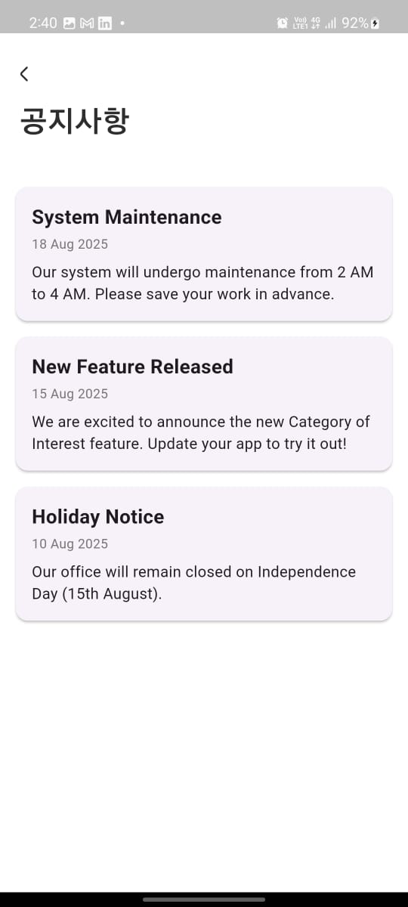
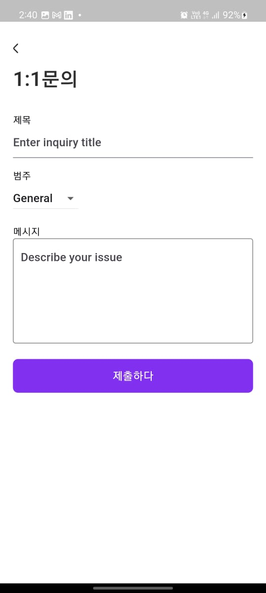
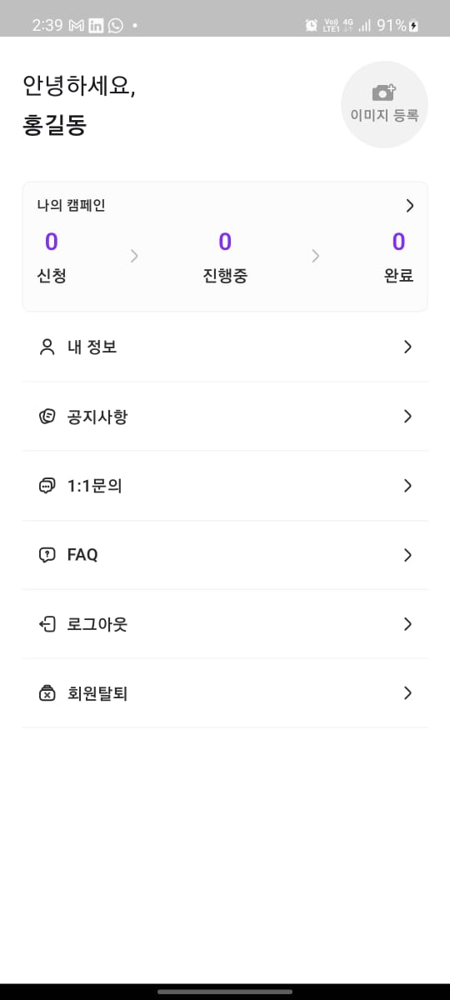
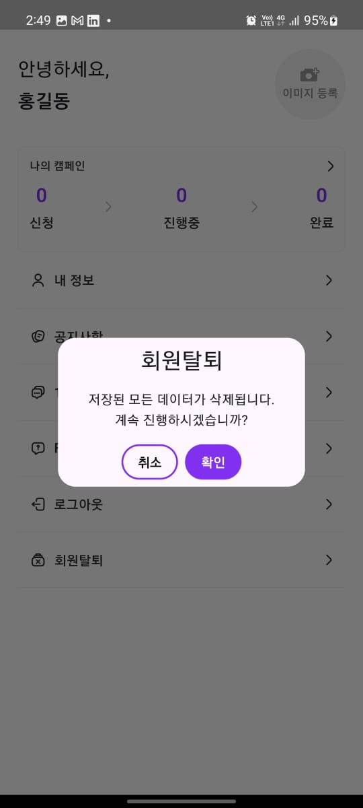

---

```markdown
# 📱 Flutter App – Document & Inquiry Management

A Flutter-based mobile application designed for document handling, inquiries, and user profile management.  
The app provides a simple and lightweight architecture using **GetX** and **GetStorage**, while ensuring smooth performance.

---

## 📂 Project Structure

```

lib/
│── app/
│   ├── common\_widgets/   # Shared UI components
│   ├── controllers/      # GetX controllers (business logic & state)
│   ├── routes/           # Navigation & routing
│   ├── utils/            # Constants, helpers, app colors, etc.
│   └── views/            # Screens (UI pages)
└── main.dart             # Entry point

````

---

## 📸 Screens

| Login | Announcements | FAQ |
|-------|---------------|-----|
|  |  |  |

| Inquiry | Profile | Delete Account |
|---------|---------|----------------|
|  |  |  |

---

## 📦 Dependencies

The project uses a **minimal set of lightweight packages** to keep the app lean:

- **[get](https://pub.dev/packages/get)** → State management, navigation, dependency injection  
- **[flutter_svg](https://pub.dev/packages/flutter_svg)** → SVG image rendering  
- **[get_storage](https://pub.dev/packages/get_storage)** → Lightweight local storage solution  
- **[file_picker](https://pub.dev/packages/file_picker)** → File selection  
- **[image_picker](https://pub.dev/packages/image_picker)** → Image selection (camera & gallery)  
- **[open_file](https://pub.dev/packages/open_file)** → Open files with native apps  
- **[permission_handler](https://pub.dev/packages/permission_handler)** → Permission requests  

📌 **Justification**:  
All external packages are lightweight, widely adopted, and critical for functionality.  
UI is implemented mostly using **Flutter’s built-in Material widgets**, ensuring performance and maintainability.

---

## 🚀 Features

- 🔑 **Authentication flow** (login/logout)  
- 📢 **Announcements module**  
- ❓ **FAQ management**  
- 📨 **Inquiry submission**  
- 👤 **User Profile management**  
- 🗑️ **Delete Account flow**  
- 💾 **Local storage with GetStorage**  
- 🎨 **App-wide theming with custom AppColors**  

---

## 🛠️ Setup & Installation

1. Clone the repository  
   ```bash
   git clone <repo-url>
   cd project-folder
````

2. Install dependencies

   ```bash
   flutter pub get
   ```

3. Run the app

   ```bash
   flutter run
   ```

---

## 📌 Assumptions & Decisions

* Chosen **GetX** for its simplicity and minimal boilerplate.
* Used **GetStorage** instead of SharedPreferences/SQLite for lightweight storage.
* Kept **UI libraries to a minimum** (mostly Flutter Material), to avoid bloat.
* Project structure follows **MVC-ish pattern** with separation of controllers, views, and utils.
* All external dependencies are justified for either **storage, file handling, or permissions**.


```

---


